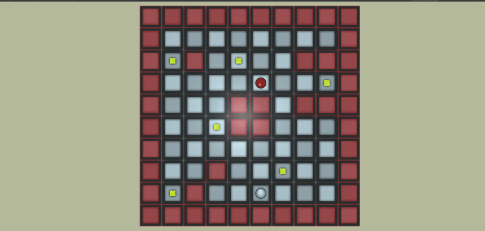
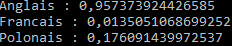

# Projets Cours Intelligence Artificielle Master 2

## PathTrouveur
Projet Unity 2020.1.4f1

Algorithmes d'A* et Dijkstra implémentés dans un petit jeu.




## BoAuEt (Boids et Automates à Etats Finis)

Projet Unity 2020.1.4f1

Algorithmes de flocking combiné avec un système à automates à etats finis.


## FANNED / UnderstandFANN

Projet Visual Studio, C#, Library FANN

Réseau de neurones de detection linguistique l'aide des frequences des caractères.

>Trois Langues : Français, Anglais, Polonais

Réseau de neurones :
 - 26 entrées (**fréquence** des lettres de l'alphabet)
 - Couche abstraite (taille arbitrairement choisi)
 - 3 sorties (**double** allant de 0 à 1 pour chaque langue)

Le réseau de neurones choisi la langue qui semble correspondre en prenant le double de sortie le plus grand.

```cs
Console.WriteLine("Anglais : {0}", result[0]);
Console.WriteLine("Francais : {0}", result[1]);
Console.WriteLine("Polonais : {0}", result[2]);
```

